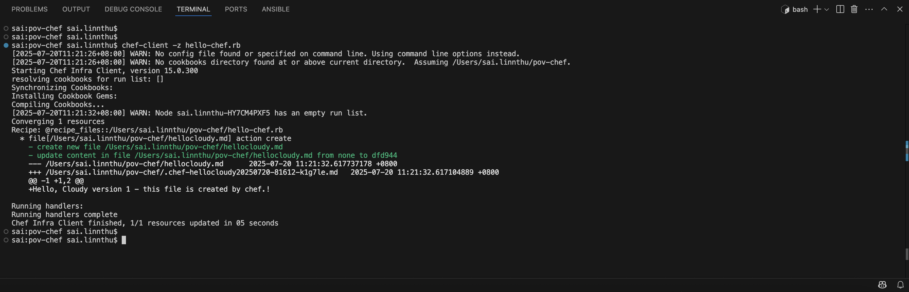

# Download and Install Chef Workstation for Open Source Users
* https://www.chef.io/downloads

* If you're using `Ubuntu`
```
sudo dpkg -i chef-workstation_0.4.2-1_amd64.deb 
```

### Verify `which chef`

```
$ which chef
/usr/local/bin/chef

$ ls -la /usr/local/bin/ | grep chef
lrwxr-xr-x   1 root         wheel         31 20 Jul 01:13 berks -> /opt/chef-workstation/bin/berks
lrwxr-xr-x   1 root         wheel         30 20 Jul 01:13 chef -> /opt/chef-workstation/bin/chef
lrwxr-xr-x   1 root         wheel         36 20 Jul 01:13 chef-apply -> /opt/chef-workstation/bin/chef-apply
lrwxr-xr-x   1 root         wheel         37 20 Jul 01:13 chef-client -> /opt/chef-workstation/bin/chef-client
lrwxr-xr-x   1 root         wheel         34 20 Jul 01:13 chef-run -> /opt/chef-workstation/bin/chef-run
lrwxr-xr-x   1 root         wheel         36 20 Jul 01:13 chef-shell -> /opt/chef-workstation/bin/chef-shell
lrwxr-xr-x   1 root         wheel         35 20 Jul 01:13 chef-solo -> /opt/chef-workstation/bin/chef-solo
lrwxr-xr-x   1 root         wheel         36 20 Jul 01:13 chef-vault -> /opt/chef-workstation/bin/chef-vault
lrwxr-xr-x   1 root         wheel         35 20 Jul 01:13 cookstyle -> /opt/chef-workstation/bin/cookstyle
lrwxr-xr-x   1 root         wheel         29 20 Jul 01:13 dco -> /opt/chef-workstation/bin/dco
lrwxr-xr-x   1 root         wheel         34 20 Jul 01:13 delivery -> /opt/chef-workstation/bin/delivery
lrwxr-xr-x   1 root         wheel         36 20 Jul 01:13 foodcritic -> /opt/chef-workstation/bin/foodcritic
lrwxr-xr-x   1 root         wheel         32 20 Jul 01:13 inspec -> /opt/chef-workstation/bin/inspec
lrwxr-xr-x   1 root         wheel         33 20 Jul 01:13 kitchen -> /opt/chef-workstation/bin/kitchen
lrwxr-xr-x   1 root         wheel         31 20 Jul 01:13 knife -> /opt/chef-workstation/bin/knife
lrwxr-xr-x   1 root         wheel         30 20 Jul 01:13 ohai -> /opt/chef-workstation/bin/ohai
lrwxr-xr-x   1 root         wheel         36 20 Jul 01:13 push-apply -> /opt/chef-workstation/bin/push-apply
lrwxr-xr-x   1 root         wheel         38 20 Jul 01:13 pushy-client -> /opt/chef-workstation/bin/pushy-client
lrwxr-xr-x   1 root         wheel         47 20 Jul 01:13 pushy-service-manager -> /opt/chef-workstation/bin/pushy-service-manager
lrwxr-xr-x   1 root         wheel         52 20 Jul 01:13 uninstall_chef_workstation -> /opt/chef-workstation/bin/uninstall_chef_workstation
```

### Verify `/opt/chef-workstation/bin/`
```
$ ls -la /opt/chef-workstation/bin/
total 9864
drwxr-xr-x  27 root  wheel      864 12 Jun  2019 .
drwxr-xr-x  11 root  wheel      352 20 Jul 01:13 ..
-rw-r--r--   1 root  wheel        0 12 Jun  2019 .gitkeep
-rwxr-xr-x   1 root  wheel     9814 12 Jun  2019 berks
-rwxr-xr-x   1 root  wheel     9809 12 Jun  2019 chef
-rwxr-xr-x   1 root  wheel     9822 12 Jun  2019 chef-apply
-rwxr-xr-x   1 root  wheel     9823 12 Jun  2019 chef-client
-rwxr-xr-x   1 root  wheel     9835 12 Jun  2019 chef-resource-inspector
-rwxr-xr-x   1 root  wheel     9820 12 Jun  2019 chef-run
-rwxr-xr-x   1 root  wheel     9832 12 Jun  2019 chef-service-manager
-rwxr-xr-x   1 root  wheel     9822 12 Jun  2019 chef-shell
-rwxr-xr-x   1 root  wheel     9821 12 Jun  2019 chef-solo
-rwxr-xr-x   1 root  wheel     9822 12 Jun  2019 chef-vault
-rwxr-xr-x   1 root  wheel     9832 12 Jun  2019 chef-windows-service
-rwxr-xr-x   1 root  wheel     9818 12 Jun  2019 cookstyle
-rwxr-xr-x   1 root  wheel     9794 12 Jun  2019 dco
-rwxr-xr-x   1 root  wheel  4772636 12 Jun  2019 delivery
-rwxr-xr-x   1 root  wheel     9824 12 Jun  2019 foodcritic
-rwxr-xr-x   1 root  wheel     9818 12 Jun  2019 inspec
-rwxr-xr-x   1 root  wheel     9825 12 Jun  2019 kitchen
-rwxr-xr-x   1 root  wheel     9805 12 Jun  2019 knife
-rwxr-xr-x   1 root  wheel     9802 12 Jun  2019 ohai
-rwxr-xr-x   1 root  wheel     9871 12 Jun  2019 print_execution_environment
-rwxr-xr-x   1 root  wheel     9854 12 Jun  2019 push-apply
-rwxr-xr-x   1 root  wheel     9856 12 Jun  2019 pushy-client
-rwxr-xr-x   1 root  wheel     9865 12 Jun  2019 pushy-service-manager
-rwxr-xr-x   1 root  wheel      996  3 May  2019 uninstall_chef_workstation
```

---
# Running Chef in Zero Mode
* When you run `chef-client -z hello-chef.rb` (the `-z` or `--local-mode` flag means Chef runs without a central server), Chef Infra Client generates a folder named `node` in your working directory.

* `node/[hostname].json` - Stores system attributes, custom attributes, and Chef run metadata. The node object contains:
  * **System attributes** - Information about your system (OS, hardware, network, etc.) collected by Ohai.
    * `ohai` comes bundled with Chef Workstation.
      ```
      $ ohai --version
        Ohai: 15.0.35
      ```
  * **Node attributes** - Any custom attributes defined in your recipes or cookbooks.
  * **Run list** - The list of recipes/roles that should be applied to this node.
  * **Chef run metadata** - Information about the last Chef run (timestamp, success/failure, etc.).

* This file persists between runs and helps Chef maintain `idempotency`.

### Create a file called `hello-chef.rb`
```
file '/Users/sai.linnthu/pov-chef/hellocloudy.md' do
  content 'Hello, Cloudy version 1 - this file is created by chef.!'
end
```

### Run the recipe with `--local-mode` or `-z` flag
* 
```
chef-client -z hello-chef.rb
```
* Output


* As a Result of that, `hellocloudy.md` file will be created.


---
# [Ohai](https://docs.chef.io/ohai/)
* Ohai is a `system profiling tool` used by Chef to collect detailed information about your node. When you run Chef Infra Client, Ohai automatically gathers system attributes such as:
  * operating system, 
  * hardware specs, 
  * network settings, 
  * disk usage, memory, CPU info, virtualization status, and more.

* This data is provided as [`automatic attributes`](https://docs.chef.io/ohai/#automatic-attributes) to Chef, enabling recipes and cookbooks to make decisions based on the node’s real configuration. 

* To verify `ohai`
```
# Check if ohai is available
sai:pov-chef$ ohai --version
Ohai: 15.0.35

# Just use it directly
sai:pov-chef$ ohai platform
[
  "macos"
]
sai:pov-chef$ ohai memory
{
  "total": "32768MB",
  "active": "11111MB",
  "inactive": "7367MB",
  "free": "14289MB"
}
sai:pov-chef$ ohai os
[
  "darwin"
]

# To check nested attribute
sai:pov-chef$ ohai memory/free
[
  "13316MB"
]

```

# ohai-test
* You can find the script under `ohai-test` directory.

### Run `chef exec ruby ohai_test.rb `
* Use `chef exec` - Runs the command in context of the embedded ruby
* Chef Workstation uses its own isolated Ruby environment.
```
$ chef exec ruby ohai_test.rb 
Starting Ohai system scan...
========================================
Platform: macos
Platform Version: 15.5
Total Memory: 32768MB
Hostname: sai
Architecture: x86_64
========================================
Ohai test completed!
```

### Option 2 - `#!/opt/chef-workstation/embedded/bin/ruby` shebang approach
```
$ chef exec which ruby
/opt/chef-workstation/embedded/bin/ruby

# Add this line to `ohai_test.rb`
#!/opt/chef-workstation/embedded/bin/ruby

Make it executable
chmod +x ohai_test.rb
```
```
$ ./ohai_test.rb 
Starting Ohai system scan...
========================================
Platform: macos
Platform Version: 15.5
Total Memory: 32768MB
Hostname: sai
Architecture: x86_64
========================================
Ohai test completed!
```

* Note: You're getting `x86_64` instead of `arm64` because you're likely running the Intel version of Chef Workstation under **Rosetta translation.**
```
sai:ohai-test sai.linnthu$ chef exec ruby -e "puts RUBY_PLATFORM"
x86_64-darwin16

sai:ohai-test sai.linnthu$ uname -m
arm64

sai:ohai-test sai.linnthu$ arch
arm64

sai:ohai-test sai.linnthu$ file /opt/chef-workstation/embedded/bin/ruby
/opt/chef-workstation/embedded/bin/ruby: Mach-O 64-bit executable x86_64

```
* Extended Test - `chef exec ruby ohai_extended_test.rb `
```
$ chef exec ruby ohai_extended_test.rb 
==============================
Ohai Test Result!
==============================
=== CPU Info ===
CPU Count: 12
CPU Model: N/A

=== Network ===
IP Address: 192.168.1.197
MAC Address: 42:bc:a8:b3:28:78

=== Network Info ===
Hostname: sai
IP Address: 192.168.1.197
MAC Address: 42:bc:a8:b3:28:78
==============================
Ohai test completed!
==============================
```